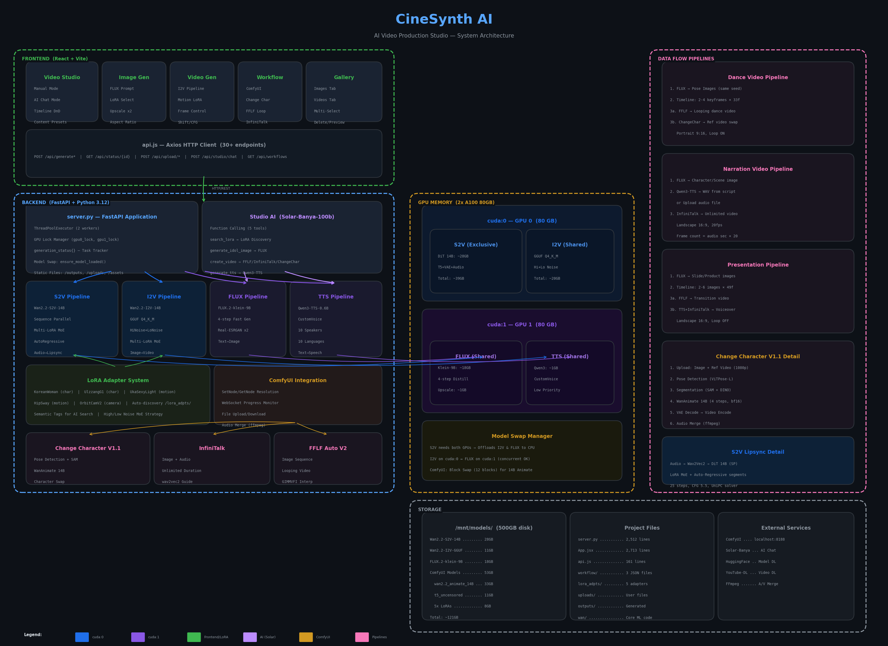

# CineSynth AI

AI 비디오 프로덕션 스튜디오 — 텍스트, 이미지, 음성에서 다양한 유형의 고퀄리티 영상을 생성하는 통합 파이프라인.



## 파이프라인

```
텍스트 프롬프트 ──→ [FLUX.2-klein-9B] ──→ 이미지 ──→ [Real-ESRGAN x2] ──→ 업스케일 이미지
                                             │
                    ┌────────────────────────┼───────────────────────────┐
                    ▼                        ▼                          ▼
            [Wan2.2-I2V-14B]        [ComfyUI Workflows]        [Wan2.2-S2V-14B]
             이미지→비디오         FFLF / ChangeChar / InfiniTalk      립싱크 비디오
```

| 단계 | 모델 | 설명 |
|------|-------|------|
| **Image Gen** | FLUX.2-klein-9B (9B) | 텍스트→이미지, 4스텝 고속 생성 |
| **Upscale** | Real-ESRGAN x2 | 720x1280 → 1440x2560 업스케일링 |
| **Video Gen** | Wan2.2-I2V-14B-A (14B) | 이미지→비디오 + 모션 LoRA |
| **Video Studio** | ComfyUI Workflows | FFLF 루프, Change Character, InfiniTalk |
| **Workflow** | ComfyUI Integration | 워크플로우별 동적 UI + 실시간 진행률 |

## 주요 기능

### UI 메뉴 구조
- **Video Studio**: 수동 모드 (Step 1-2-3) + AI 어시스턴트 (Solar-Banya-100b 채팅)
- **Image Gen**: FLUX.2-klein-9B 이미지 생성 + Real-ESRGAN x2 업스케일
- **Video Gen**: Wan2.2-I2V-14B 이미지→비디오 + Multi-LoRA MoE
- **Workflow**: ComfyUI 워크플로우 (Change Character, FFLF, InfiniTalk)
- **Gallery**: 이미지/비디오 탭 분리, 삭제 기능, 워크플로우용 다중 선택

### 핵심 기능
- **FLUX.2-klein-9B**: 9B 텍스트→이미지 모델, 4스텝 고속 생성 (guidance_scale=1.0)
- **Real-ESRGAN x2**: 생성 이미지 2배 업스케일링 (RRDBNet, tile=512)
- **Multi-LoRA 시스템**: 여러 LoRA 어댑터 동시 적용, 어댑터별 가중치 조절
- **High/Low Noise MoE**: 디퓨전 스텝별 다른 LoRA 가중치 (고노이즈 vs 저노이즈)
- **LoRA 카테고리**: `img/` (이미지 생성), `mov/` (비디오 생성) 자동 분류
- **Wan2.2-I2V-14B-A**: 이미지→비디오 생성 (SVI 2.0 Pro)
- **Sequence Parallel (SP)**: 2+ GPU에서 torchrun 기반 DeepSpeed Ulysses SP로 DiT 어텐션 병렬화
- **GPU 모델 스왑**: 4개 모델(S2V, I2V, FLUX, TTS)이 GPU VRAM 공유, 자동 CPU 오프로드
- **속도 최적화**: UniPC 솔버 (25 steps) + infer_frames 80 + TeaCache (0.15 threshold)
- **ComfyUI 워크플로우**: Change Character V1.1, FFLF Auto Loop V2, InfiniTalk
- **YouTube 다운로드**: 고해상도(1080p) YouTube 비디오 자동 다운로드 (bestvideo+bestaudio)
- **Qwen3-TTS**: 텍스트 대본 → 음성 합성 (10개 언어, CustomVoice)
- **Studio AI**: Solar-Banya-100b function calling으로 자동 비디오 생성
- **FastAPI 서버**: REST API 기반 생성 서버 + React 프론트엔드
- **다국어 UI**: 한국어, 영어, 중국어 지원
- **LoRA 파인튜닝**: 특정 인물에 대한 립싱크 품질 향상

## Change Character V1.1 최적 설정 (Production)

> **2026-02-15 확정** — 얼굴 디테일, 손가락 형태, 전체 품질 모두 최상의 결과를 보인 설정.
> 이 설정을 변경할 때는 반드시 품질 비교 테스트를 수행할 것.

### 모델 및 양자화

| 항목 | 값 | 비고 |
|------|-----|------|
| **모델** | `Wan22Animate/wan2.2_animate_14B_bf16.safetensors` | 33GB bf16 원본 모델 |
| **양자화** | `fp8_e4m3fn` | 런타임 FP8 양자화. `fp8_e4m3fn_scaled`는 사용 불가 (모델에 pre-scaled 가중치 없음) |
| **base_precision** | `bf16` | |
| **attention_mode** | `sageattn` | SageAttention 메모리 효율 어텐션 |
| **rms_norm_function** | `pytorch` | cuDNN 대신 PyTorch native |
| **load_device** | `offload_device` | |

### 샘플러 설정

| 항목 | 값 | 비고 |
|------|-----|------|
| **스케줄러** | `euler` | FlowMatchEulerDiscreteScheduler. float 타임스텝 [1000.0, 979.77, ...] |
| **스텝** | `14` | LightX2V distill LoRA 사용 시 최적 (8=최소, 12=밸런스, 14=최적 품질) |
| **CFG** | `1.0` | **반드시 1.0 유지**. CFG 5.0은 얼굴 블러 유발 (Wan Animate는 CFG 1.0이 공식 권장) |
| **shift** | `8.0` | 공식 기본값은 5.0이나 8.0에서 더 다이나믹한 모션 |

### TeaCache

| 항목 | 값 | 비고 |
|------|-----|------|
| **rel_l1_thresh** | `0.15` | 0.3은 너무 공격적 → 품질 저하. 0.15가 속도/품질 균형점 |
| **start_step** | `1` | 첫 스텝은 구도 결정이므로 캐시 스킵 |
| **use_coefficients** | `true` | |
| **cache_device** | `offload_device` | |

### LoRA (5개, 런타임 어댑터)

| LoRA | 강도 | 용도 |
|------|------|------|
| `lightx2v_elite_it2v_animate_face` | **1.0** | Distill 가속 (1.2는 아티팩트 유발) |
| `WAN22_MoCap_fullbodyCOPY_ED` | 0.4 | 모션 캡처 |
| `Wan2.2-Fun-A14B-InP-Fusion-Elite` | 0.65 | InPaint Fusion |
| `FullDynamic_Ultimate_Fusion_Elite` | 0.7 | 다이나믹 퓨전 |
| `WanAnimate_relight_lora_fp16` | 0.7 | 리라이팅 |

### 해상도 및 메모리

| 항목 | 값 | 비고 |
|------|-----|------|
| **해상도** | `720x1280` | 얼굴 디테일 유지 최소 해상도. 480x832는 눈 블러 발생 |
| **blocks_to_swap** | `20` | 40블록 중 20블록을 RAM으로 스왑 (VRAM 절약) |
| **frame_window_size** | `77` | 공식 기본값, 시간 일관성 최적 |

### 품질 문제 원인 기록

| 증상 | 원인 | 해결 |
|------|------|------|
| 얼굴 블러/뭉개짐 | CFG 5.0 | **CFG 1.0으로 변경** |
| 손가락 기형/뿌옇게 | GGUF Q4_K_M 양자화 (4bit) | **bf16 + fp8_e4m3fn으로 변경** |
| 전체 디테일 부족 | 스텝 수 부족 (4-8 스텝) | **14 스텝으로 증가** |
| TeaCache 품질 저하 | rel_l1_thresh 0.3 (너무 공격적) | **0.15로 감소** |
| LightX2V 아티팩트 | 강도 1.2 (과도) | **1.0으로 감소** |
| `fp8_e4m3fn_scaled` 에러 | bf16 모델에 pre-scaled 가중치 없음 | **`fp8_e4m3fn` 사용** |

### 성능

- 스텝당 약 37초 (TeaCache 히트 시 ~17초)
- 77 프레임 청크당 약 5-8분
- 265 프레임 (4 청크) 영상 약 25-35분

## 시스템 요구사항

| 항목 | 요구사항 |
|------|----------|
| Python | 3.12+ |
| CUDA | 12.4+ |
| GPU | 2x NVIDIA A100 80GB (권장) |
| VRAM | GPU 0: ~39GB (DiT), GPU 1: ~15GB (T5) |
| RAM | 64GB+ |
| 디스크 | ~60GB (모델 체크포인트) |

> **단일 GPU 모드**: 1x A100 80GB에서도 실행 가능 (CPU offload 활용)

## 설치

### 1. 리포지토리 클론

```bash
git clone https://github.com/tonythefreedom/WanAvatar.git
cd WanAvatar
```

### 2. 가상환경 생성

```bash
python3.12 -m venv venv
source venv/bin/activate
```

### 3. 의존성 설치

```bash
# PyTorch (CUDA 12.4)
pip install torch==2.6.0 torchvision torchaudio --index-url https://download.pytorch.org/whl/cu124

# 프로젝트 의존성
pip install -r requirements.txt
pip install -r requirements_wan22.txt
pip install -r requirements_s2v.txt

# flash-attn (필수 - S2V 모델이 flash_attention()을 직접 호출)
pip install wheel
pip install flash-attn==2.7.4.post1 --no-build-isolation

# FLUX 이미지 생성 + Real-ESRGAN 업스케일링
pip install -U diffusers>=0.36.0
pip install realesrgan basicsr
```

> **주의**: `flash-attn 2.8.3`은 PyTorch 2.6.0과 ABI 호환성 문제가 있어 `2.7.4.post1` 버전을 사용합니다.

### 4. 시스템 패키지

```bash
# ffmpeg (비디오+오디오 병합에 필요)
sudo apt-get install ffmpeg
```

### 5. 모델 다운로드

```bash
pip install huggingface-hub

# S2V (립싱크)
huggingface-cli download Wan-AI/Wan2.2-S2V-14B --local-dir /mnt/models/Wan2.2-S2V-14B

# I2V (이미지→비디오)
huggingface-cli download Wan-AI/Wan2.2-I2V-14B-A --local-dir /mnt/models/Wan2.2-I2V-14B-A

# FLUX.2-klein-9B (텍스트→이미지, 첫 실행 시 자동 다운로드 가능)
huggingface-cli download black-forest-labs/FLUX.2-klein-9B --local-dir /mnt/models/hub/FLUX.2-klein-9B
```

### 6. Real-ESRGAN 가중치 다운로드

```bash
mkdir -p weights
wget -O weights/RealESRGAN_x2plus.pth \
  https://github.com/xinntao/Real-ESRGAN/releases/download/v0.2.1/RealESRGAN_x2plus.pth
```

모델 구조:

```
/mnt/models/Wan2.2-S2V-14B/
├── config.json
├── diffusion_pytorch_model-00001-of-00004.safetensors
├── diffusion_pytorch_model-00002-of-00004.safetensors
├── diffusion_pytorch_model-00003-of-00004.safetensors
├── diffusion_pytorch_model-00004-of-00004.safetensors
├── diffusion_pytorch_model.safetensors.index.json
├── Wan2.1_VAE.pth                          # Wan2.1 VAE (공식 모델에 포함)
├── models_t5_umt5-xxl-enc-bf16.pth        # T5 텍스트 인코더
├── google/umt5-xxl/                        # T5 토크나이저
└── wav2vec2-large-xlsr-53-english/         # Wav2Vec 오디오 인코더
```

> **참고**: Wan2.2-S2V-14B 공식 모델은 `Wan2.1_VAE.pth` (Wan2.1 VAE 아키텍처)를 사용합니다. 이는 정상입니다.

## 실행

### 백엔드 서버 (FastAPI)

```bash
# 방법 1: start.sh (GPU 자동 감지)
bash start.sh

# 방법 2: 직접 실행
source venv/bin/activate
python server.py
```

- 서버: `http://localhost:8000`
- API 문서: `http://localhost:8000/docs`
- 프론트엔드: `http://localhost:8000` (빌드된 React 앱을 백엔드가 서빙)

`start.sh`는 GPU 수를 자동 감지하여:
- **2+ GPU**: `torchrun --nproc_per_node=N server.py` (Sequence Parallel 활성화)
- **1 GPU**: `python server.py` (싱글 프로세스)
- **SP 비활성화**: `DISABLE_SP=1 bash start.sh`

> **참고**: 서버 시작 시 S2V 모델 로딩에 약 3~5분 소요됩니다. `Uvicorn running on http://0.0.0.0:8000` 로그가 출력되면 접근 가능합니다.

### 프론트엔드 (React)

**프로덕션 모드**: 백엔드가 `frontend/dist/` 정적 파일을 자동 서빙하므로 별도 실행 불필요. 프론트엔드 변경 시:

```bash
cd frontend
npm run build    # dist/ 에 빌드
# 브라우저 새로고침하면 반영 (서버 재시작 불필요)
```

**개발 모드** (HMR 지원, Node.js 20.19+ 필요):

```bash
cd frontend
npm install      # 최초 1회
npm run dev      # Vite 개발 서버: http://localhost:5173
```

개발 모드에서는 Vite가 5173 포트에서 프론트엔드를 서빙하고, API 요청(`/api`, `/outputs`, `/uploads`, `/avatars`, `/backgrounds`)을 백엔드(8000)로 프록시합니다. 코드 수정 시 즉시 반영(Hot Module Replacement).

| 모드 | 접근 URL | 프론트엔드 | 백엔드 | 서버 재시작 필요 |
|------|---------|-----------|--------|--------------|
| 프로덕션 | `http://localhost:8000` | 백엔드가 dist/ 서빙 | 동일 프로세스 | 백엔드 변경 시만 |
| 개발 | `http://localhost:5173` | Vite HMR | 별도 프로세스(8000) | 백엔드 변경 시만 |

### Gradio 웹 인터페이스

```bash
python app.py           # 로컬 접속
python app.py --share   # 공개 URL 생성
```

포트: `http://0.0.0.0:7891`

## API 사용법

### 비디오 생성

```bash
# 1. 참조 이미지 업로드
IMAGE=$(curl -s -F "file=@reference.png" http://localhost:8000/api/upload/image)
IMAGE_PATH=$(echo $IMAGE | python3 -c "import sys,json; print(json.load(sys.stdin)['path'])")

# 2. 오디오 업로드
AUDIO=$(curl -s -F "file=@audio.wav" http://localhost:8000/api/upload/audio)
AUDIO_PATH=$(echo $AUDIO | python3 -c "import sys,json; print(json.load(sys.stdin)['path'])")

# 3. 생성 요청
TASK=$(curl -s -X POST http://localhost:8000/api/generate \
  -H "Content-Type: application/json" \
  -d "{
    \"image_path\": \"$IMAGE_PATH\",
    \"audio_path\": \"$AUDIO_PATH\",
    \"resolution\": \"480*832\",
    \"inference_steps\": 15,
    \"infer_frames\": 80,
    \"seed\": 42
  }")
TASK_ID=$(echo $TASK | python3 -c "import sys,json; print(json.load(sys.stdin)['task_id'])")

# 4. 상태 확인
curl -s http://localhost:8000/api/status/$TASK_ID | python3 -m json.tool
```

### API 엔드포인트

| 엔드포인트 | 메서드 | 설명 |
|-----------|--------|------|
| `/api/generate` | POST | S2V 립싱크 비디오 생성 |
| `/api/generate-i2v` | POST | I2V 이미지→비디오 생성 |
| `/api/generate-flux` | POST | FLUX 텍스트→이미지 생성 |
| `/api/status/{task_id}` | GET | 생성 진행 상황 확인 |
| `/api/upload/image` | POST | 참조 이미지 업로드 |
| `/api/upload/audio` | POST | 오디오 파일 업로드 |
| `/api/upload/video` | POST | 비디오 파일 업로드 |
| `/api/uploads/images` | GET | 업로드된 이미지 목록 |
| `/api/uploads/audio` | GET | 업로드된 오디오 목록 |
| `/api/outputs` | GET | 출력 파일 목록 (이미지 + 비디오) |
| `/api/outputs/{filename}` | DELETE | 출력 파일 삭제 |
| `/api/videos` | GET | 생성된 비디오 목록 |
| `/api/videos/{filename}` | DELETE | 비디오 삭제 |
| `/api/lora-adapters` | GET | LoRA 어댑터 목록 (?category=img/mov) |
| `/api/t2i-status` | GET | FLUX 모델 상태 확인 |
| `/api/extract-audio` | POST | 비디오에서 오디오 추출 |
| `/api/extract-frame` | POST | 비디오에서 첫 프레임 추출 |
| `/api/separate-vocals` | POST | 보컬 분리 |
| `/api/config` | GET | 서버 설정 |
| `/api/health` | GET | 서버 상태 확인 (SP 상태 포함) |
| `/api/workflows` | GET | ComfyUI 워크플로우 목록 |
| `/api/workflow/generate` | POST | 워크플로우 실행 |
| `/api/workflow/status` | GET | ComfyUI 연결 상태 확인 |
| `/api/workflow/prepare-images` | POST | 갤러리 이미지를 워크플로우용 폴더로 복사 |
| `/api/download-youtube` | POST | YouTube 비디오 다운로드 |

### 생성 파라미터

#### S2V (립싱크)

| 파라미터 | 기본값 | 설명 |
|---------|--------|------|
| `resolution` | `720*1280` | 출력 해상도 (`480*832` 권장 - 빠름) |
| `inference_steps` | `25` | 디노이징 스텝 수 (높을수록 품질↑, 속도↓) |
| `infer_frames` | `80` | 세그먼트당 프레임 수 (~5초@16fps) |
| `guidance_scale` | `5.5` | CFG 스케일 |
| `seed` | `-1` | 랜덤 시드 (-1: 무작위) |
| `use_teacache` | `false` | TeaCache 캐싱 활성화 (품질 저하 가능) |
| `lora_weights` | `[]` | Multi-LoRA 설정 (name, high_weight, low_weight) |

#### I2V (이미지→비디오)

| 파라미터 | 기본값 | 설명 |
|---------|--------|------|
| `image_path` | (필수) | 입력 이미지 경로 |
| `prompt` | | 모션 프롬프트 |
| `frame_num` | `81` | 출력 프레임 수 |
| `inference_steps` | `40` | 디노이징 스텝 수 |
| `guidance_scale` | `5.0` | CFG 스케일 |
| `shift` | `5.0` | 노이즈 스케줄 시프트 |
| `lora_weights` | `[]` | Multi-LoRA 설정 (name, high_weight, low_weight) |

#### FLUX (텍스트→이미지)

| 파라미터 | 기본값 | 설명 |
|---------|--------|------|
| `prompt` | (필수) | 텍스트 프롬프트 |
| `num_inference_steps` | `4` | 디노이징 스텝 (FLUX.2-klein: 1-12) |
| `guidance_scale` | `1.0` | CFG 스케일 |
| `upscale` | `true` | Real-ESRGAN x2 업스케일링 적용 |
| `seed` | `-1` | 랜덤 시드 |

### Multi-LoRA 시스템

LoRA 어댑터는 `lora_adpts/`에서 자동 탐색됩니다:

```
lora_adpts/
├── mov/              # 비디오 생성 LoRA (I2V/S2V)
│   ├── character/    # 캐릭터 스타일링
│   ├── move/         # 모션/댄스
│   └── camera/       # 카메라 컨트롤
└── img/              # 이미지 생성 LoRA (FLUX)
```

**High/Low Noise MoE 전략**: 디퓨전 단계에 따라 LoRA 가중치를 동적 조절
- 고노이즈 스텝 (초반): `high_weight` 적용 — 전체 구조/포즈 제어
- 저노이즈 스텝 (후반): `low_weight` 적용 — 세부 디테일 보존

## 아키텍처

### GPU 추론 모드

#### 모드 1: Sequence Parallel (SP) — `torchrun` (기본, 2+ GPU)

```
GPU 0: 전체 모델 (DiT + T5 + VAE + Audio) — Rank 0 (API 서버)
GPU 1: 전체 모델 (DiT + T5 + VAE + Audio) — Rank 1 (워커)
```

- **DeepSpeed Ulysses** 기반: 시퀀스를 GPU 수로 분할, all-to-all로 어텐션 헤드 교환
- Rank 0이 FastAPI 서버 + 생성 조율, Rank 1은 워커 루프에서 대기
- 생성 파라미터는 `dist.broadcast`로 동기화
- `start.sh`가 자동 감지하여 `torchrun --nproc_per_node=N` 실행

#### 모드 2: 듀얼 GPU (T5 분리) — `DISABLE_SP=1`

```
GPU 0 (~39GB): DiT 14B 트랜스포머 + VAE + Audio Encoder
GPU 1 (~15GB): T5 텍스트 인코더 (umt5-xxl)
```

- 모델은 CPU에서 먼저 로드 후 각 GPU로 이동 (OOM 방지)
- T5 인코더의 출력은 GPU 간 자동 전송

#### 모드 3: 싱글 GPU

- 1 GPU만 있으면 자동으로 싱글 프로세스 모드

### Auto-Regressive 세그먼트 생성

긴 오디오(예: 25초)는 자동으로 여러 세그먼트로 분할됩니다:

```
[세그먼트 1] → [세그먼트 2] → [세그먼트 3] → ... → [최종 비디오]
     ↓              ↓              ↓
  참조 이미지    이전 마지막    이전 마지막
  기반 생성     프레임 참조    프레임 참조
```

- `infer_frames=80` → 세그먼트당 ~5초 (80프레임 / 16fps)
- 25초 오디오 → ~6개 세그먼트
- 각 세그먼트는 이전 세그먼트의 마지막 프레임을 motion reference로 사용

### 속도 최적화

| 최적화 | 효과 | 비고 |
|--------|------|------|
| UniPC 솔버 | 40 → 25 steps | 품질 유지하면서 1.6x 속도 향상 |
| infer_frames 80 | 세그먼트 수 감소 | 40 → 80 프레임으로 세그먼트 절반 |
| Sequence Parallel | GPU 간 시퀀스 분할 | 2+ GPU에서 DiT 어텐션 병렬화 |
| TeaCache | 유사 스텝 캐싱 | thresh=0.15, 기본 OFF (품질 우선) |

### 비디오 저장

생성된 비디오는 `save_videos_grid`로 저장 후 `ffmpeg`로 오디오를 병합합니다:

```python
# 비디오 프레임 저장
save_videos_grid(video[None], video_path, rescale=True, fps=16)

# 오디오 병합
ffmpeg -y -i video.mp4 -i audio.wav -c:v copy -c:a aac -shortest output.mp4
```

## 프로젝트 구조

```
WanAvatar/
├── server.py                 # FastAPI 서버 (포트 8000)
│                             #   - S2V/I2V/FLUX 모델 관리
│                             #   - GPU 모델 스왑 (자동 CPU 오프로드)
│                             #   - Multi-LoRA, Real-ESRGAN 통합
├── app.py                    # Gradio 웹 앱 (포트 7891)
├── start.sh                  # 서버 시작 스크립트
├── generate.py               # CLI 생성 스크립트
├── train_14B_lora.py         # 14B LoRA 학습 스크립트
├── train_lora_14B.sh         # LoRA 학습 실행 스크립트
├── preprocess_training_data.py  # 학습 데이터 전처리
├── lip_mask_extractor.py     # 얼굴/입술 마스크 추출
├── audio_extractor.py        # 오디오 추출
├── vocal_seperator.py        # 보컬 분리
├── frontend/                 # React 프론트엔드
│   ├── src/
│   │   ├── App.jsx           # 5페이지 UI (Studio, Image Gen, Video Gen, Workflow, Gallery)
│   │   ├── App.css
│   │   └── api.js            # API 클라이언트
│   └── vite.config.js
├── workflow/                 # ComfyUI 워크플로우
│   ├── Change_character_V1.1_api.json   # 캐릭터 변경 워크플로우
│   └── wan_fflf_auto_v2_api.json        # FFLF 자동 루프 워크플로우
├── lora_adpts/               # LoRA 어댑터 (자동 탐색)
│   ├── mov/                  # 비디오 LoRA (character/, move/, camera/)
│   └── img/                  # 이미지 LoRA (FLUX용)
├── weights/                  # 업스케일러 가중치
│   └── RealESRGAN_x2plus.pth
├── wan/
│   ├── speech2video.py       # S2V 추론 파이프라인
│   │                         #   - Multi-LoRA + High/Low Noise MoE
│   │                         #   - TeaCache 통합
│   │                         #   - Auto-Regressive 생성
│   ├── image2video.py        # I2V 추론 파이프라인
│   │                         #   - Multi-LoRA + High/Low Noise MoE
│   ├── animate.py            # 애니메이션 파이프라인
│   ├── modules/
│   │   ├── s2v/              # S2V 모델 컴포넌트
│   │   │   ├── model_s2v.py  # WanModel_S2V 트랜스포머
│   │   │   ├── audio_encoder.py
│   │   │   └── motioner.py
│   │   ├── model.py          # 기본 모델 정의
│   │   ├── attention.py      # Flash Attention 2
│   │   ├── t5.py             # T5 텍스트 인코더
│   │   ├── vae2_1.py         # Wan2.1 VAE (S2V-14B 사용)
│   │   └── vae2_2.py         # Wan2.2 VAE (TI2V-5B 등 사용)
│   ├── configs/              # 모델 설정
│   │   └── wan_s2v_14B.py    # S2V 14B 설정
│   ├── models/
│   │   └── cache_utils.py    # TeaCache 계수 및 유틸리티
│   ├── utils/                # 유틸리티 (솔버, LoRA 등)
│   └── distributed/          # 분산 학습 유틸리티
├── examples/                 # 테스트용 예제 이미지
│   └── case-tony/
│       ├── reference01.png   # 464x688 참조 이미지
│       ├── reference02.png   # 512x768 참조 이미지
│       └── sample.wav        # 25.7초 테스트 오디오
├── outputs/                  # 생성된 비디오 출력
├── uploads/                  # 업로드된 파일
├── deepspeed_config/         # DeepSpeed 설정
│   └── wan2.2/
│       └── wan_s2v_14b.yaml
├── accelerate_config/        # Accelerate 설정
├── requirements.txt          # 기본 의존성
├── requirements_wan22.txt    # Wan2.2 의존성
└── requirements_s2v.txt      # S2V 의존성
```

## LoRA 파인튜닝

특정 인물에 대한 립싱크 품질을 향상시키기 위해 LoRA 파인튜닝을 수행할 수 있습니다. 소량의 비디오 데이터(10~30개, 각 3~6초)로 개인화된 모델을 학습합니다.

### 개요

| 항목 | 사양 |
|------|------|
| 기반 모델 | Wan2.2-S2V-14B (18.9B 전체 파라미터) |
| 학습 파라미터 | LoRA (rank 128) + Vocal/Audio Projector |
| LoRA 모듈 수 | 488개 (Transformer 내 Linear/Conv2d 레이어) |
| 학습 시간 | ~3-4시간 (2x A100 80GB, 10 epochs, 21개 비디오) |
| VRAM | ~45-55GB/GPU (DeepSpeed ZeRO Stage 2) |
| RAM | ~100GB+ (CPU optimizer offload) |
| GPU | 2x A100 80GB 권장 (1x도 가능하나 느림) |

### 학습 구조

```
┌─────────────────────────────────────────────────────────┐
│                    학습 파이프라인                          │
├─────────────────────────────────────────────────────────┤
│                                                         │
│  [Frozen] VAE Encoder → Latents                        │
│  [Frozen] T5 Text Encoder → Text Embeddings            │
│  [Frozen] CLIP Image Encoder → Image Embeddings        │
│  [Frozen] Wav2Vec2 → Vocal Features                    │
│                                                         │
│  [Trainable] LoRA Adapters (488 modules, rank 128)     │
│  [Trainable] Vocal/Audio Projector                     │
│  [Trainable] Audio Injector                            │
│  [Trainable] Patch Embedding (16→36ch, inpainting)     │
│                                                         │
│  Loss = MSE + Face/Lip Mask Weighting + Motion Loss    │
│                                                         │
└─────────────────────────────────────────────────────────┘
```

**학습 대상 파라미터:**

| 구분 | 설명 |
|------|------|
| LoRA Adapters | Transformer의 Linear/Conv2d 레이어 488개에 적용 (rank=128, alpha=64) |
| Vocal Projector | 음성 특성을 DiT 차원으로 변환하는 프로젝터 (from scratch) |
| Audio Injector | 오디오 컨텍스트를 Transformer 블록에 주입 (from scratch) |
| Patch Embedding | 16→36 채널 확장 (noisy latent + mask + masked latent) |

**고정(Frozen) 파라미터:**

- VAE (Wan2.1_VAE) — 비디오 인코딩/디코딩
- T5 텍스트 인코더 (umt5-xxl) — 텍스트 프롬프트 인코딩
- CLIP 이미지 인코더 — 참조 이미지 임베딩
- Wav2Vec2 — 음성 특징 추출

### 추가 모델 다운로드

학습에는 CLIP 이미지 인코더가 추가로 필요합니다 (S2V 추론 모델에는 미포함):

```bash
# 방법 1: HuggingFace에서 직접 다운로드 (권장)
source venv/bin/activate
huggingface-cli download Wan-AI/Wan2.1-I2V-14B-480P \
  models_clip_open-clip-xlm-roberta-large-vit-huge-14.pth \
  --local-dir /mnt/models/Wan2.2-S2V-14B
```

```bash
# 방법 2: open_clip에서 추출
pip install open-clip-torch
python -c "
import open_clip, torch
model, _, _ = open_clip.create_model_and_transforms(
    'xlm-roberta-large-ViT-H-14',
    pretrained='frozen_laion5b_s13b_b90k'
)
torch.save(model.visual.state_dict(),
    '/mnt/models/Wan2.2-S2V-14B/models_clip_open-clip-xlm-roberta-large-vit-huge-14.pth')
"
```

다운로드 후 모델 디렉토리 확인:

```
/mnt/models/Wan2.2-S2V-14B/
├── diffusion_pytorch_model-0000{1..4}-of-00004.safetensors  # DiT 14B
├── Wan2.1_VAE.pth                                           # VAE
├── models_t5_umt5-xxl-enc-bf16.pth                          # T5
├── models_clip_open-clip-xlm-roberta-large-vit-huge-14.pth  # CLIP (4.5GB, 학습용)
├── google/umt5-xxl/                                         # T5 토크나이저
└── wav2vec2-large-xlsr-53-english/                           # Wav2Vec2
```

### 학습 데이터 구조

#### 디렉토리 구조

각 학습 샘플은 아래 구조의 디렉토리입니다:

```
FT_data/
├── processed/                    # 전처리된 학습 데이터
│   ├── video_000/
│   │   ├── sub_clip.mp4          # 원본 비디오 (3-6초, 24fps)
│   │   ├── audio.wav             # 16kHz 모노 WAV (Wav2Vec2 입력)
│   │   ├── images/               # 추출된 프레임
│   │   │   ├── frame_0000.png    # PNG 형식, 원본 해상도
│   │   │   ├── frame_0001.png
│   │   │   └── ...
│   │   ├── face_masks/           # 얼굴 영역 마스크 (MediaPipe)
│   │   │   ├── frame_0000.png    # 그레이스케일, 0(배경)/255(얼굴)
│   │   │   ├── frame_0001.png
│   │   │   └── ...
│   │   └── lip_masks/            # 입술 영역 마스크 (MediaPipe)
│   │       ├── frame_0000.png    # 그레이스케일, 0(배경)/255(입술)
│   │       ├── frame_0001.png
│   │       └── ...
│   ├── video_001/
│   ├── ...
│   └── video_path.txt            # 비디오 디렉토리 절대 경로 목록
└── reference.jpeg                # (선택) 참조 이미지 원본
```

#### video_path.txt 형식

각 줄에 학습 샘플 디렉토리의 절대 경로를 기재합니다:

```
/home/ubuntu/WanAvatar/FT_data/processed/video_000
/home/ubuntu/WanAvatar/FT_data/processed/video_001
/home/ubuntu/WanAvatar/FT_data/processed/video_002
...
```

#### 마스크 상세

| 마스크 타입 | 생성 방법 | 용도 |
|------------|-----------|------|
| face_masks | MediaPipe FaceLandmarker (FACE_OVAL 36점 컨투어) | 얼굴 영역 Loss 가중치 |
| lip_masks | MediaPipe FaceLandmarker (LIP_OUTER 20점 컨투어) | 입술 영역 Loss 가중치 |

- 형식: 그레이스케일 PNG (0-255), 학습 시 0-1로 정규화
- 프레임별 1:1 대응 (같은 파일명)
- 얼굴 미감지 시 이전 프레임 마스크 재사용, 첫 프레임 미감지 시 전체 흰색(255)

### 데이터 전처리

원본 MP4 비디오에서 학습 데이터를 자동 생성합니다:

```bash
# 1. 원본 비디오를 FT_data/ 에 배치
ls FT_data/*.mp4

# 2. MediaPipe 모델 다운로드 (최초 1회)
wget -O face_landmarker_v2_with_blendshapes.task \
  https://storage.googleapis.com/mediapipe-models/face_landmarker/face_landmarker/float16/1/face_landmarker.task

# 3. 전처리 실행
source venv/bin/activate
python preprocess_ft_data.py
```

전처리 과정:
1. 비디오 복사 → `sub_clip.mp4`
2. ffmpeg로 오디오 추출 → `audio.wav` (16kHz, 모노)
3. OpenCV로 프레임 추출 → `images/frame_XXXX.png`
4. MediaPipe FaceLandmarker로 얼굴/입술 마스크 생성
5. 검증용 데이터 생성 → `validation/reference.png`, `validation/audio.wav`

> **데이터 권장사항:**
> - 비디오 수: 10~30개 (많을수록 좋으나 학습 시간 증가)
> - 비디오 길이: 3~6초 (너무 짧으면 프레임 부족, 너무 길면 메모리 부족)
> - 해상도: 최소 480p 이상 (학습 시 자동 리사이즈)
> - 얼굴 정면 위주, 다양한 표정/입모양 포함
> - 배경이 깔끔한 영상 선호

### 3가지 종횡비 모드

학습 시 3가지 종횡비로 동시 학습하여 다양한 출력 해상도를 지원합니다:

| 모드 | 해상도 (W×H) | 종횡비 | 용도 |
|------|-------------|--------|------|
| **rec** (landscape) | 832×480 | ~16:9 | 가로 영상 |
| **square** | 512×512 | 1:1 | 정사각형 |
| **vec** (portrait) | 480×832 | ~9:16 | 세로 영상 (모바일) |

- 동일한 학습 데이터를 3가지 해상도로 리사이즈하여 사용
- 에폭 내에서 3가지 모드가 랜덤하게 교차 학습
- `--train_data_rec_dir`, `--train_data_square_dir`, `--train_data_vec_dir`에 같은 `video_path.txt` 지정 가능

### Loss 함수

**기본 Loss**: Flow Matching MSE (예측 노이즈 vs 실제 노이즈)

**얼굴/입술 마스크 가중치** (확률적 선택):

| 확률 | Loss 계산 | 설명 |
|------|----------|------|
| 40% | `MSE × (1 + face_mask + lip_mask)` | 전체 프레임 + 얼굴/입술 강조 |
| 10% | `MSE × face_mask` | 얼굴 영역만 |
| 50% | `MSE × lip_mask` | 입술 영역만 (립싱크 중심) |

**Motion Sub-Loss** (옵션, `--motion_sub_loss`):
- 연속 프레임 간 차이의 MSE를 추가하여 자연스러운 움직임 학습
- `loss = loss × 0.75 + motion_loss × 0.25`

**Dropout 전략:**
- CLIP 이미지 드롭아웃: 10% 확률로 이미지 컨텍스트 제거 (텍스트/오디오 의존도 향상)
- Vocal 임베딩 드롭아웃: 10% 확률로 음성 임베딩 제거

### 학습 실행

```bash
# 서버 중지 후 학습 시작 (GPU 메모리 확보)
bash train_lora_14B.sh
```

#### 주요 하이퍼파라미터

| 파라미터 | 기본값 | 설명 |
|---------|--------|------|
| `--learning_rate` | `1e-4` | LoRA + Vocal Projector 학습률 |
| `--num_train_epochs` | `10` | 에폭 수 |
| `--train_batch_size` | `1` | GPU당 배치 크기 |
| `--gradient_accumulation_steps` | `8` | Gradient 누적 (실효 배치 = 1×8×2GPU = 16) |
| `--video_sample_n_frames` | `81` | 학습 프레임 수 (~5초@16fps) |
| `--checkpointing_steps` | `500` | 체크포인트 저장 간격 (global steps, 총 스텝보다 크면 최종만 저장) |
| `--max_grad_norm` | `0.05` | Gradient clipping |
| `--adam_weight_decay` | `3e-2` | AdamW weight decay |
| `--motion_sub_loss` | 활성화 | Motion sub-loss 사용 |
| `--low_vram` | 활성화 | 메모리 절약 모드 |

#### DeepSpeed 설정

`deepspeed_config/zero2_config.json`:

| 항목 | 설정 |
|------|------|
| ZeRO Stage | 2 (optimizer state + gradient partitioning) |
| Optimizer Offload | CPU (pin_memory=True) |
| Mixed Precision | bf16 |
| Gradient Clipping | 0.05 |

### 체크포인트

체크포인트는 DeepSpeed 전체 상태가 아닌 **LoRA 가중치와 Projector 가중치만 직접 저장**합니다. 이는 멀티 GPU 환경에서 NCCL 통신 교착상태를 방지하고 저장 속도를 크게 향상시킵니다.

**저장 경로**: `output_lora_14B/checkpoint-{step}/`

**저장 파일:**

| 파일 | 크기 (예시) | 설명 |
|------|------------|------|
| `lora_weights.safetensors` | ~1.4 GB | LoRA 어댑터 가중치 (rank=128, 488 modules) |
| `projector_weights.pt` | ~4.8 GB | Vocal/Audio Projector, Audio Injector, Patch Embedding 등 학습된 추가 파라미터 (203개) |

**저장 방식:**
- `accelerator.save_state()` (DeepSpeed 전체 상태) 대신 모델에서 직접 추출하여 저장
- LoRA: `safetensors` 형식으로 저장 (hash 메타데이터 포함)
- Projector: `torch.save()`로 state_dict 저장
- Main process(rank 0)에서만 저장 — NCCL 집합 통신 불필요

> **참고**: 현재 방식은 옵티마이저 상태를 저장하지 않으므로 이어서 학습(resume)은 지원하지 않습니다. 처음부터 재학습이 필요합니다.

### 학습 모니터링

```bash
# TensorBoard로 학습 곡선 확인
tensorboard --logdir output_lora_14B --port 6006

# 실시간 로그 확인
tail -f training.log
```

### 학습된 LoRA 적용

학습 완료 후 체크포인트의 가중치를 모델에 로드하여 추론합니다:

```
output_lora_14B/checkpoint-50/
├── lora_weights.safetensors    # LoRA 어댑터 (1.4GB)
└── projector_weights.pt        # Vocal/Audio Projector (4.8GB)
```

서버 시작 시 자동으로 LoRA 체크포인트를 감지하고 로드합니다:

- **경로**: `LORA_CHECKPOINT_DIR` (server.py 상단에 설정)
- **강도**: `LORA_STRENGTH = 0.5` (0.0=미적용, 1.0=전체 적용)
- **effective_scale**: `strength × alpha / rank = 0.5 × 64 / 128 = 0.25`
- `/api/health` 응답에서 `lora_enabled`, `lora_checkpoint` 필드로 확인 가능

## Changelog

### 2026-02-14: Dance Shorts 독립 메뉴 + UI 개편 + 메뉴 구조 변경

**Dance Shorts 독립 메뉴 (`App.jsx`, `App.css`, `api.js`, `server.py`):**

- **사이드바 독립 메뉴**: Video Studio Step 3의 하위 탭에서 사이드바 최상위 메뉴로 분리
- **듀얼 패널 레이아웃**: 좌측(설정) + 우측(YouTube 설정 & 출력)
- **아바타 갤러리 연동**: 등록된 아바타 그룹에서 캐릭터 이미지 직접 선택 + 업로드
- **스테이지 갤러리**: 배경 이미지 선택/업로드/삭제 (기존 `listBackgrounds`/`uploadBackground` API 재사용)
- **YouTube Shorts 설정**: 채널 URL, 채널명 (기본: `Dancing Yuna`), Title/Description/Hashtags 기본값 자동 생성
  - Title 기본: `{아바타이름} #shorts - YYYY:MM:DD:HH:MM`
  - Description 기본: `{아바타이름} {채널명} 많이 사랑해 주세요. 구독 좋아요 부탁드립니다.`
  - Hashtags 기본: `#{채널명} #dancecover`
- **생성 완료 후 YouTube 업로드**: 빈 필드는 기본값으로 자동 채움

**메뉴 구조 변경:**

| 변경 전 | 변경 후 | 비고 |
|---------|---------|------|
| Video Studio (studio) | **삭제** | FFLF, InfiniTalk, 타임라인 등 전체 제거 |
| Workflow (workflow) | **Video Studio** (workflow) | 메뉴명 변경, 아이콘 변경 |
| — | **Dance Shorts** (danceshorts) | 신규 독립 메뉴 |

- 사이드바 순서: Dance Shorts → Image Gen → Video Gen → Video Studio → Gallery → Admin

**Backend 추가 (`server.py`):**

- `DELETE /api/backgrounds/{filename}`: 배경 이미지 삭제 (파일 + DB)
- `sync_background_files()` 양방향 동기화: 파일 추가/삭제 모두 처리
- `/api/backgrounds` 호출 시 자동 동기화

**Frontend API 추가 (`api.js`):**

- `deleteBackground(filename)`: 배경 삭제 API

### 2026-02-14: LoRA 머지 GGUF + GGUF 로딩 버그 수정 + 배경 자동 동기화 + 갤러리 업로드

**5 LoRA 머지 Q4_K_M GGUF 모델 (`workflow/Change_character_V1.1_api.json`, `server.py`):**

- **LoRA 머지 파이프라인**: 5개 LoRA를 bf16 기본 모델에 머지 → BF16 GGUF 변환 → Q4_K_M 양자화
  - 머지 LoRA: WanAnimate_style, WanAnimate_camera, WanAnimate_appearance, WanAnimate_motion, WanAnimate_relight
  - 변환 도구: ComfyUI-GGUF convert.py (BF16 GGUF) + 패치된 llama-quantize (Q4_K_M)
  - 5D 텐서 복구: fix_5d_tensors.py (patch_embedding.weight, pose_patch_embedding.weight)
  - 최종 모델: `Wan22Animate_merged_loras-Q4_K_M.gguf` (11GB)
- **런타임 LoRA 로딩 제거**: 모든 LoRA가 모델에 bake-in → 로딩 시간 단축, VRAM 절약
- **MAX_FRAMES 확장**: 481 (30초) → 601 (~37.5초) — 더 긴 영상 지원
- **VRAM 사용량**: ~32GB 피크 (Q4_K_M + block swap)

**WanVideoWrapper GGUF 로딩 버그 수정 (`nodes_model_loading.py`, 업스트림 PR 대상):**

- **GGUFParameter 바이트 shape 문제**: `load_gguf()`가 반환하는 GGUFParameter meta 텐서의 `.shape`가 논리적 shape이 아닌 바이트 shape 반환
  - Q4_K [5120, 5120] → 바이트 shape [5120, 2880] (block_size=256, type_size=144)
  - 모델 config 추론 시 `in_features=2880` 설정 → `normalized_shape=[2880]`으로 RMSNorm 오류
  - 수정: `_shape()` 헬퍼 함수로 `quant_shape` 사용 (모든 sd shape 접근에 적용)
- **motion_encoder Q4_K 비호환**: EqualConv2d/EqualLinear가 GGUFParameter의 `__torch_function__` 오버라이드와 충돌
  - 수정: motion_encoder/face_encoder/face_adapter 양자화 가중치를 로딩 시 float32로 디퀀타이즈

**Change Character V1.1 최적화:**

- **TeaCache 통합**: `rel_l1_thresh: 0.3`, `use_coefficients: true` — 30-45% 샘플링 속도 향상
- **동적 frame_load_cap**: 비디오 길이에서 자동 계산 (`ffprobe` → `duration × 16fps` → 4k+1 정렬)
- **rms_norm_function: pytorch**: cuDNN 대신 PyTorch native RMS norm 사용
- **Block Swap**: `blocks_to_swap: 20`, `vace_blocks_to_swap: 0` (VRAM 절약)
- **SageAttention**: `attention_mode: sageattn` (메모리 효율 어텐션)

**A100 호환성 이슈 해결:**

| 최적화 | 상태 | 비고 |
|--------|------|------|
| TeaCache | ✅ 적용 | 30-45% 속도 향상, 독립 동작 |
| LoRA 머지 GGUF Q4_K_M | ✅ 적용 | 5 LoRA bake-in, VRAM 60% 절감 |
| FP8 e4m3fn | ❌ 제거 | A100 (compute 8.0) + torch.compile 시 triton fp8e4nv 미지원 |
| torch.compile | ❌ 제거 | FP8 호환 불가, bf16에서는 OOM |
| batched_cfg | ❌ 제거 | TeaCache와 `is_uncond` 파라미터 충돌 |
| rms_norm pytorch | ✅ 적용 | cuDNN 의존성 제거 |
| Block Swap 20 | ✅ 적용 | VRAM ↔ RAM 블록 교체 |

**배경 자동 동기화 (`server.py`):**

- `sync_background_files()`: 서버 시작 시 `background/stages/` 디렉토리 스캔
- 파일시스템에 있지만 DB에 없는 배경 이미지 자동 등록
- 지원 확장자: `.jpg`, `.jpeg`, `.png`, `.webp`
- 기존 `init_db()`, `migrate_existing_files()` 이후 실행

**갤러리 직접 업로드 (`server.py`, `App.jsx`, `api.js`):**

- `POST /api/gallery/upload`: 이미지/영상 파일을 갤러리에 직접 업로드
  - 지원 형식: 이미지 (.jpg/.jpeg/.png/.webp), 영상 (.mp4/.avi/.mov/.webm)
  - `outputs/upload_{uuid}.{ext}` 형식으로 저장, `user_files`에 자동 기록
- 갤러리 헤더에 업로드 버튼 추가 (멀티파일 지원)
- 업로드 진행률 실시간 표시
- 삭제 시 DB + 파일 동시 정리

**Queue UI 썸네일 (`App.jsx`):**

- 대기열 아이템에 아바타, 비디오(첫 프레임), 배경 썸네일 표시
- 워크플로우별 입력 파라미터 시각적 프리뷰

**버그 수정:**

- `UPLOADS_DIR` → `UPLOAD_DIR` 변수명 오류 수정 (server.py)
- `vace_blocks_to_swap: None` → `0` (TypeError 방지, model.py:2068)
- `fp8_e4m3fn_scaled` → `fp8_e4m3fn` (A100 compute 8.0 호환)

### 2026-02-13: BFS Face Swap + Avatar Prepare 파이프라인 + 갤러리 아바타 등록

**BFS Face Swap 워크플로우 (`workflow/flux_klein_faceswap_api.json`, `server.py`):**

- Flux2 Klein 9B + BFS Head Swap LoRA (rank-128) 기반 얼굴 교체 워크플로우
- 듀얼 레퍼런스 이미지: Picture 1 (타겟 바디) + Picture 2 (스타일 소스)
- `FluxKontextMultiReferenceLatentMethod` (index 방식) 다중 참조 체인
- 입력: Avatar (유지할 얼굴) + Style Source (몸/의상/배경)
- **최적 설정 (턱선 보존 튜닝 결과):**

| 파라미터 | 값 | 설명 |
|---------|-----|------|
| LoRA Strength | **0.8** | BFS LoRA 영향력 — 1.0에서 낮춰 원본 얼굴 형태(턱선 등) 보존 |
| CFG Scale | **4.0** | Klein Base 기본값, 프롬프트 준수와 자연스러움 균형 |
| Steps | **16** | 과도한 처리로 인한 얼굴 변형 방지, 속도 향상 (~50초/이미지) |
| Sampler | euler | Flux2 Klein 권장 |
| Scheduler | Flux2Scheduler | 해상도 기반 자동 시그마 계산 |

- 프롬프트에 턱선 보존 지시 포함: "exact jawline shape and face contour. Do not alter the jawline"
- 네거티브 프롬프트: "angular jaw, sharp jawline, square jaw, altered face shape"
- `crop_face_head` 3단계 얼굴 감지: 원본 → 상반신 → 상단 1/3 (mediapipe blaze_face_short_range)
- 얼굴 면적 >15%이면 크롭 스킵, 그 외 패딩 2.5x 포트레이트 크롭

**Avatar Prepare 2단계 파이프라인 (`workflow/flux_klein_pose_edit_api.json`, `server.py`):**

- **Step 1 (Klein Pose Edit):** 원본 이미지 → 전신, 차렷 자세, 크로마키 초록 배경으로 변환
  - LoRA 없이 Flux2 Klein base 모델만 사용
  - 프롬프트: "full body photo... attention pose... solid bright green chroma key background..."
- **Step 2 (BFS Face Swap):** Step 1 결과에 원본 얼굴 복원
  - BFS LoRA strength 0.85 (일반 face_swap 1.1 대비 부드러운 복원)
  - Step 1 출력 = 타겟 바디, 원본 이미지 = 얼굴 소스
- 최종 결과를 아바타 디렉토리에 자동 등록

**갤러리 → 아바타 등록 (`App.jsx`, `api.js`):**

- 갤러리 Avatar 버튼 클릭 시 Avatar Prepare 파이프라인 자동 실행
- 진행 상황 실시간 폴링 (3초 간격) + 버튼에 진행률 표시
- 완료 시 아바타 그룹에 자동 등록 + 사이드바 갤러리 새로고침

**새 API 엔드포인트:**

| 엔드포인트 | 메서드 | 설명 |
|-----------|--------|------|
| `/api/prepare-avatar` | POST | Avatar Prepare 파이프라인 실행 (2단계) |
| `/api/register-avatar` | POST | 이미지를 아바타로 직접 등록 |

**기타 변경:**

- Fashion Change 완료 후 자동 아바타 등록 제거 (갤러리에서 수동 등록으로 대체)
- Face Swap 입력 방향 수정: Avatar = 타겟 바디 (node 10), Style Source = 얼굴 (node 11)
- "Face Source" → "Style Source" 명칭 변경 (EN/KO/ZH)
- Vite 개발 서버 프록시 경로 추가: `/avatars`, `/backgrounds`

### 2026-02-13: 로그인/회원가입 + 사용자 관리 + 계정별 데이터 관리

**인증 시스템 (`server.py`, `App.jsx`, `api.js`):**

- Google OAuth 2.0 회원가입 (Google Identity Services 팝업 모드)
- Super Admin 이메일/비밀번호 로그인 (`.env`의 `SUPER_ADMIN` + `ADMIN_PASS`)
- JWT 토큰 인증 (7일 만료, `Authorization: Bearer` 헤더)
- SQLite DB (`wanavatardb.sqlite3`) — `users` + `user_files` 테이블
- 신규 Google 가입자는 `pending` 상태 → 관리자 승인 필요

**사용자 관리 Admin 패널:**

- 전체 사용자 목록 (이메일, 이름, 역할, 상태, 가입일, 마지막 로그인)
- 사용자 승인 (pending → approved), 정지 (→ suspended), 활성화 (→ approved), 삭제
- Super Admin 사이드바에 "Users" 메뉴 표시

**계정별 데이터 관리:**

- 업로드(이미지/오디오/비디오), 배경, 아바타, 출력물 모두 계정별 분리
- `user_files` DB 테이블에서 `user_id` 기반 소유권 관리
- 최초 서버 시작 시 기존 파일 자동 마이그레이션 (Super Admin 계정으로)
- 아바타 그룹: `metadata` JSON의 `json_extract(metadata, '$.group')`으로 관리

**인증 API 엔드포인트:**

| 엔드포인트 | 메서드 | 설명 |
|-----------|--------|------|
| `/api/auth/login` | POST | 이메일+비밀번호 로그인 → JWT |
| `/api/auth/google` | POST | Google ID 토큰 검증 → JWT |
| `/api/auth/me` | GET | 현재 사용자 정보 |
| `/api/admin/users` | GET | 전체 사용자 목록 (관리자) |
| `/api/admin/users/{id}/approve` | POST | 사용자 승인 |
| `/api/admin/users/{id}/suspend` | POST | 사용자 정지 |
| `/api/admin/users/{id}/activate` | POST | 사용자 활성화 |
| `/api/admin/users/{id}` | DELETE | 사용자 삭제 |

**프론트엔드 UI:**

- 로그인 페이지: Google Sign-In 버튼 + 이메일/비밀번호 폼 + ID 저장 체크박스
- 승인 대기 페이지: `pending` 상태 사용자에게 안내 메시지 표시
- 헤더: 프로필 아바타 + 이름 + 로그아웃 버튼
- Admin 패널: 사용자 관리 테이블 (역할/상태 배지 컬러)
- Change Character V1.1 생성 버튼 초록색으로 변경

**환경 변수 (`.env`):**

| 변수 | 설명 |
|------|------|
| `JWT_SECRET` | JWT 서명 키 |
| `GOOGLE_CLIENT_ID` | Google OAuth 웹 클라이언트 ID |
| `SUPER_ADMIN` | Super Admin 이메일 |
| `ADMIN_PASS` | Super Admin 비밀번호 |

### 2026-02-12: ComfyUI 워크플로우 통합 + LoRA UI 개선

**ComfyUI 워크플로우 시스템 (`server.py`, `App.jsx`):**

- ComfyUI 원격 실행 통합 — `WORKFLOW_REGISTRY`로 워크플로우 정의, `workflow/` 디렉토리에서 API JSON 자동 탐색
- 워크플로우별 동적 UI 자동 생성: 이미지/비디오/텍스트/슬라이더/셀렉트/토글 입력 타입 지원
- ComfyUI WebSocket 연결로 실시간 진행률 모니터링
- 이미지 → ComfyUI 자동 업로드, 결과 비디오 자동 다운로드

**등록된 워크플로우:**

| 워크플로우 | 설명 |
|-----------|------|
| **Change Character V1.1** | 참조 비디오의 캐릭터를 사용자 이미지로 교체 (정면 사진 1장) |
| **FFLF Auto Loop V2** | 이미지 시퀀스에서 듀얼 패스 샘플링으로 루핑 전환 비디오 생성 |
| **Face Swap (BFS)** | Flux2 Klein + BFS LoRA 기반 얼굴 교체 (아바타 바디 + 스타일 소스) |
| **Fashion Change** | 아바타 의상 변경 (Try-On LoRA) |

**워크플로우 입력 기능:**

- 비디오 입력: 파일 업로드 / YouTube URL 다운로드 전환 탭
- 갤러리 선택: 기존 갤러리 이미지를 다중 선택하여 워크플로우 입력으로 사용
- 비율 선택: Portrait (9:16) / Landscape (16:9) / Square (1:1)
- YouTube 다운로드: URL 입력 → `yt-dlp`으로 자동 다운로드 후 입력으로 연결

**새 API 엔드포인트:**

| 엔드포인트 | 메서드 | 설명 |
|-----------|--------|------|
| `/api/workflows` | GET | 사용 가능한 워크플로우 목록 |
| `/api/workflow/generate` | POST | 워크플로우 실행 시작 |
| `/api/workflow/status` | GET | ComfyUI 연결 상태 확인 |
| `/api/workflow/prepare-images` | POST | 갤러리 이미지를 워크플로우용 폴더로 복사 |
| `/api/download-youtube` | POST | YouTube 비디오 다운로드 |

**LoRA UI 개선 (`App.jsx`, `App.css`):**

- **트리거 워드 버튼**: 각 LoRA의 트리거 워드 태그에 `+` (프롬프트에 추가) / 클립보드 복사 버튼 추가
- **다중 선택**: 같은 카테고리의 LoRA를 동시 적용 가능 (라디오 → 체크박스 전환)
- **추천값 표시**: 각 LoRA 슬라이더 옆에 "추천: X.X" 배지 표시, 클릭 시 추천값으로 리셋
- 다국어 지원 (EN/KO/ZH): 트리거 워드 복사/추가, 다중 선택, 추천값 관련 번역 추가

### 2026-02-12: I2V LoRA 버그 수정 (GGUF + diffusers WanImageToVideoPipeline)

**I2V 파이프라인 전환:**

- 커스텀 WanI2V 클래스 → `diffusers.WanImageToVideoPipeline` + GGUF Q4_K_M 양자화 전환
- `WanTransformer3DModel.from_single_file()` + `GGUFQuantizationConfig(compute_dtype=bfloat16)`
- HighNoise (transformer) + LowNoise (transformer_2) MoE 구조 유지
- 모델 크기: ~9.65GB/expert (Q4_K_M), 총 ~20GB (기존 ~28GB fp8 대비 절감)

**LoRA 3중 버그 수정 (`server.py`):**

1. **`LORA_SCALE_CORRECTION` 32배 과보정 제거**: diffusers가 Kohya LoRA 변환 시 `alpha/rank`를 가중치에 직접 bake → PEFT에서 `lora_alpha=rank`, scaling=1.0. `set_adapters(weight=1.0)` = ComfyUI strength 1.0. 불필요한 `rank/alpha` 보정이 32배 과도한 weight를 만들어 영상 픽셀 깨짐 유발
2. **`set_adapters(..., component="transformer_2")` 잘못된 파라미터 제거**: `LoraBaseMixin.set_adapters()`는 `component` 인자를 받지 않음. `WanLoraLoaderMixin`이 `_lora_loadable_modules = ["transformer", "transformer_2"]`를 순회하며 각 transformer에 존재하는 adapter만 자동 활성화
3. **`set_adapters` 이중 호출 → 단일 호출**: 첫 번째 호출에서 high adapters만 지정하면 transformer_2의 low adapters가 전부 비활성화됨 → HIGH + LOW 어댑터를 하나의 리스트로 합쳐서 단일 호출

**수정된 LoRA 활성화 흐름:**

```python
i2v_pipeline.disable_lora()  # 모든 어댑터 비활성화
if all_adapter_names:
    i2v_pipeline.enable_lora()
    # HIGH + LOW 합쳐서 단일 호출 — 파이프라인이 각 transformer에 자동 분배
    i2v_pipeline.set_adapters(all_adapter_names, adapter_weights=all_adapter_weights)
```

**테스트 스크립트 (`test_i2v_lora.py`):**

- 17프레임 (~1초) 빠른 LoRA 검증 스크립트
- 테스트 시나리오: none (base), ulzzang, uka, both, hipsway
- PEFT adapter debug (rank, alpha, scaling 출력)
- 모든 테스트에서 정상 생성 확인

### Troubleshooting

**I2V 영상 픽셀 깨짐 (LoRA 적용 시):**

- **원인**: `LORA_SCALE_CORRECTION`이 `rank/alpha` (=32)를 곱해 weight=32 전달 → 극심한 과보정
- **확인**: PEFT debug에서 `scaling = lora_alpha / r` 값 확인. diffusers 변환 후 항상 1.0이어야 함
- **해결**: `LORA_SCALE_CORRECTION` 완전 제거. 사용자 weight를 그대로 `set_adapters()`에 전달

**`set_adapters` 호출 시 adapter 누락:**

- **원인**: `set_adapters()`를 두 번 호출하면 첫 호출에서 나머지 transformer의 adapter가 비활성화
- **해결**: HIGH + LOW adapter를 하나의 리스트로 합쳐 단일 `set_adapters()` 호출

**GGUF 모델 + LoRA 테스트 시 CUDA OOM:**

- 서버가 실행 중이면 S2V 모델이 GPU에 ~45GB 점유 → 테스트 스크립트 실행 불가
- **해결**: 서버를 중지하거나 서버 API (`/api/generate-i2v`)로 테스트 요청

### 2026-02-11: FLUX.2-klein-9B 인증 및 기본값 설정

**FLUX.2-klein-9B HuggingFace 인증:**

- HuggingFace gated repo 접근을 위한 토큰 인증 설정
- `.env`에 `HUGGINGFACE_TOKEN` 추가, `huggingface-cli login`으로 인증
- FLUX.2-klein-9B는 gated 모델로 HuggingFace 라이센스 동의 + 토큰 필요

**기본값 변경:**

- FLUX 기본 프롬프트: K-pop idol portrait 프롬프트로 변경
- Real-ESRGAN 업스케일: 기본 OFF (`upscale: false`)
- guidance_scale: 1.0 (FLUX.2-klein-9B 최적값)
- 3개 언어(EN/KO/ZH) 모두 동일 기본 프롬프트 적용

### 2026-02-11: 3단계 파이프라인 완성 (FLUX.2 + I2V + Real-ESRGAN)

**FLUX.2-klein-9B 이미지 생성 (`server.py`, `App.jsx`):**

- `diffusers.Flux2Pipeline` 기반 텍스트→이미지 생성
- 4스텝 고속 생성 (guidance_scale=1.0)
- 출력 해상도: 720x1280 (9:16, Wan I2V 입력 최적화)
- GPU 모델 스왑: S2V/I2V/FLUX 간 자동 CPU 오프로드

**Real-ESRGAN x2 업스케일링:**

- `basicsr.RRDBNet` + `realesrgan.RealESRGANer`
- 720x1280 → 1440x2560 (tile=512, half=True)
- FLUX 생성 후 옵션으로 자동 적용

**Wan2.2-I2V-14B-A 이미지→비디오 (`server.py`, `image2video.py`):**

- SVI 2.0 Pro 기반 이미지→비디오 생성
- Multi-LoRA + High/Low Noise MoE 전략
- 모션 프롬프트로 카메라/동작 제어

**Multi-LoRA 시스템 (`speech2video.py`, `image2video.py`):**

- 여러 LoRA 어댑터 동시 적용 (캐릭터 + 모션 + 카메라)
- High/Low Noise MoE: 디퓨전 스텝별 다른 가중치
- LoRA 카테고리: `img/` (FLUX), `mov/` (I2V/S2V) 자동 탐색

**갤러리 업데이트 (`App.jsx`):**

- 이미지/비디오 탭 분리
- `/api/outputs` 통합 API로 이미지+비디오 관리
- 개별 삭제 기능

**프론트엔드:**

- Image Gen 페이지: FLUX 프롬프트, 스텝/가이던스 조절, 업스케일 옵션, img LoRA 패널
- Video Gen 페이지: I2V 생성 UI, mov LoRA 패널, 사이드바 레이아웃
- diffusers 0.30.1 → 0.36.0 업그레이드 (Flux2Pipeline 지원)

### 2026-02-10: Sequence Parallel, LoRA 추론, React 프론트엔드 대폭 개선

**Sequence Parallel (SP) 지원 (`server.py`, `start.sh`, `model_s2v.py`):**

- `torchrun --nproc_per_node=N` 기반 DeepSpeed Ulysses SP 구현
- Rank 0: FastAPI 서버 + 생성 조율, Rank 1+: 워커 루프 (broadcast 대기)
- `broadcast_generate_params()`: pickle 직렬화 → NCCL broadcast로 파라미터 동기화
- NCCL timeout 7일 설정 (워커 idle 상태에서 timeout 방지)
- `start.sh`: GPU 수 자동 감지, `DISABLE_SP` 환경변수 지원
- **TeaCache + SP 호환성 수정** (`model_s2v.py`): gather_forward 순서 변경으로 shape mismatch 해결

**LoRA 추론 통합 (`speech2video.py`, `server.py`):**

- `WanS2V._apply_lora()`: 체크포인트에서 rank/alpha 자동 감지 후 LoRA 네트워크 생성
- `LORA_STRENGTH = 0.5` (effective_scale = 0.25)
- 체크포인트 경로 자동 감지 (없으면 기본 모델로 동작)
- 진행률 콜백 (`progress_callback`) 추가로 프론트엔드 진행 표시 개선

**품질 설정 최적화:**

- `inference_steps`: 15 → 25 (품질 향상)
- `guidance_scale`: 4.5 → 5.5
- `use_teacache`: true → false (기본 OFF, 품질 우선)
- `teacache_thresh`: 0.3 → 0.15
- 중국어 네거티브 프롬프트 최적화

**React 프론트엔드 (`App.jsx`, `App.css`, `api.js`):**

- 비디오 갤러리 탭: 생성된 비디오 목록, 재생, 삭제
- 파일 피커: 이전 업로드한 이미지/오디오 선택 재사용
- GPU 사용 중 표시 (gpu_busy lock)
- 다국어 (한/영/중) 번역 키 추가

### 2026-02-10: LoRA 미세조정 완료 및 체크포인트 저장 수정

**체크포인트 저장 방식 변경 (`train_14B_lora.py`):**

- `accelerator.save_state()` → LoRA/Projector 가중치 직접 저장으로 변경
- **문제**: DeepSpeed ZeRO-2에서 `save_state()` 호출 시 rank 간 NCCL 통신 필요 → rank 1이 먼저 종료되어 교착상태 발생
- **해결**: `unwrap_model()`로 원본 모델 추출 후 LoRA는 `safetensors`, Projector는 `torch.save()`로 독립 저장
- 저장 파일: `lora_weights.safetensors` (1.4GB) + `projector_weights.pt` (4.8GB)

**NCCL 타임아웃 확장:**

- `InitProcessGroupKwargs(timeout=timedelta(seconds=7200))` 추가 (기본 30분 → 2시간)
- 환경변수 `NCCL_TIMEOUT`, `TORCH_NCCL_HEARTBEAT_TIMEOUT_SEC` 추가

**학습 결과:**

- 총 학습: 50 steps (10 에폭), 3시간 37분
- 최종 Loss: 0.663-0.676
- 데이터: 21개 비디오 (145 프레임/비디오), 2x A100 80GB

### 2026-02-09: 듀얼 GPU 추론 및 속도 최적화

**핵심 변경사항:**

- **듀얼 GPU 추론**: T5 인코더를 GPU 1, DiT 트랜스포머를 GPU 0으로 분리하여 메모리 효율 극대화
  - `speech2video.py`: `t5_device_id` 파라미터 추가, GPU 간 텐서 자동 전송
  - 모델 로딩: CPU → state_dict 로드 → GPU 이동 (OOM 방지)
- **속도 최적화**: inference_steps 40→15, infer_frames 40→80 (UniPC 솔버)
- **TeaCache 통합** (실험적): `model_s2v.py`에 TeaCache 지원 추가, 캐시 비교 신호 최적화 진행 중
- **비디오 저장 수정**: `save_videos_grid` + `ffmpeg` subprocess로 오디오 병합
- **서버 설정 업데이트**: 기본값 최적화 (steps=15, infer_frames=80, offload=false)

**환경 설정:**

- flash-attn 2.7.4.post1 설치 (2.8.3은 PyTorch 2.6.0 ABI 호환 불가)
- ffmpeg 설치 (비디오+오디오 병합)

### 2026-02-09: Wan2.1 정리 및 환경 구성

**삭제된 파일 (Wan2.1/1B 전용):**

- Shell scripts: `inference.sh`, `multiple_gpu_inference.sh`, `train_lora.sh`, `train_14B.sh`, `train_14B_lora.sh`, `train_1B_*.sh`
- Python scripts: `inference.py`, `train_1B_rec_vec.py`, `train_1B_rec_vec_lora.py`, `train_1B_square.py`
- Model/pipeline: `wan_fantasy_transformer3d_1B.py`, `vocal_projector_fantasy_1B.py`, `wan_inference_long_pipeline.py`, `wan_inference_pipeline_fantasy.py`, `pipeline_wan_fun_inpaint.py`
- Configs: `wan_t2v_14B.py`, `wan_i2v_14B.py`, `wan_t2v_1_3B.py`, `wan2.1/wan_civitai.yaml`

**경로 업데이트:**

- `app.py`, `server.py`: `CHECKPOINT_DIR` → `/mnt/models/Wan2.2-S2V-14B`
- `start.sh`: Working directory → `/home/ubuntu/WanAvatar`
- `train_lora_14B.sh`: 모든 경로 업데이트

## Credits

- **Wan2.2-S2V-14B**: Alibaba's Speech-to-Video model
- **TeaCache**: Timestep Embedding Aware Cache ([ali-vilab/TeaCache](https://github.com/ali-vilab/TeaCache))
- **Flash Attention 2**: Tri Dao's flash-attn
- **StableAvatar**: Frontend inspiration ([StableAvatar](https://github.com/Francis-Rings/StableAvatar))

## License

This project is for research purposes. Please refer to the original model licenses for usage terms.
